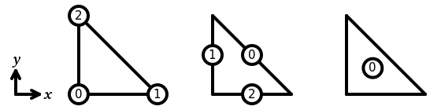
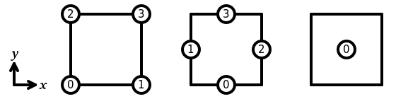
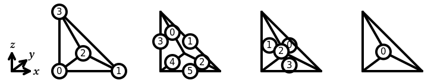
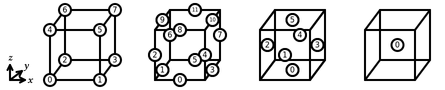
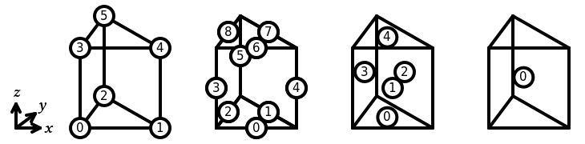
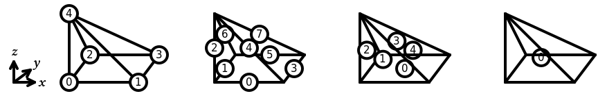

# Basix

Basix is a finite element definition and tabulation runtime library.

## Installing Basix
Basix can be installed by following [these instructions](INSTALL.md)

## Documentation
Documentation of Basix can be found [here](https://docs.fenicsproject.org/basix/main/cpp/).
Documentation of the Python interface of Basix can be found [here](https://docs.fenicsproject.org/basix/main/python/).

## Supported elements

### Interval
In Basix, the sub-entities of the reference interval are numbered as follows:

The following elements are supported on a interval:

  - [Lagrange](https://defelement.com/elements/lagrange.html)
  - [Bubble](https://defelement.com/elements/bubble.html)
  - [DPC](https://defelement.com/elements/dpc.html)
  - [Serendipity](https://defelement.com/elements/serendipity.html)

### Triangle
In Basix, the sub-entities of the reference triangle are numbered as follows:

The following elements are supported on a triangle:

  - [Lagrange](https://defelement.com/elements/lagrange.html)
  - [Nédélec](https://defelement.com/elements/nedelec1.html)
  - [Raviart-Thomas](https://defelement.com/elements/raviart-thomas.html)
  - [Nédélec Second Kind](https://defelement.com/elements/nedelec2.html)
  - [Brezzi-Douglas-Marini](https://defelement.com/elements/brezzi-douglas-marini.html)
  - [Regge](https://defelement.com/elements/regge.html)
  - [Crouzeix-Raviart](https://defelement.com/elements/crouzeix-raviart.html)
  - [Bubble](https://defelement.com/elements/bubble.html)

## Quadrilateral
In Basix, the sub-entities of the reference quadrilateral are numbered as follows:

The following elements are supported on a quadrilateral:

  - [Lagrange](https://defelement.com/elements/q.html)
  - [Nédélec](https://defelement.com/elements/qcurl.html)
  - [Raviart-Thomas](https://defelement.com/elements/qdiv.html)
  - [Bubble](https://defelement.com/elements/bubble.html)
  - [DPC](https://defelement.com/elements/dpc.html)
  - [Serendipity](https://defelement.com/elements/serendipity.html)

### Tetrahedron
In Basix, the sub-entities of the reference tetrahedron are numbered as follows:

The following elements are supported on a tetrahedron:

  - [Lagrange](https://defelement.com/elements/lagrange.html)
  - [Nédélec](https://defelement.com/elements/nedelec1.html)
  - [Raviart-Thomas](https://defelement.com/elements/raviart-thomas.html)
  - [Nédélec Second Kind](https://defelement.com/elements/nedelec2.html)
  - [Brezzi-Douglas-Marini](https://defelement.com/elements/brezzi-douglas-marini.html)
  - [Regge](https://defelement.com/elements/regge.html)
  - [Crouzeix-Raviart](https://defelement.com/elements/crouzeix-raviart.html)
  - [Bubble](https://defelement.com/elements/bubble.html)

## Hexahedron
In Basix, the sub-entities of the reference hexahedron are numbered as follows:

The following elements are supported on a hexahedron:

  - [Lagrange](https://defelement.com/elements/q.html)
  - [Nédélec](https://defelement.com/elements/qcurl.html)
  - [Raviart-Thomas](https://defelement.com/elements/qdiv.html)
  - [Brezzi-Douglas-Marini](https://defelement.com/elements/sdiv.html)
  - [Nédélec Second Kind](https://defelement.com/elements/scurl.html)
  - [Bubble](https://defelement.com/elements/bubble.html)
  - [DPC](https://defelement.com/elements/dpc.html)
  - [Serendipity](https://defelement.com/elements/serendipity.html)

## Prism
In Basix, the sub-entities of the reference prism are numbered as follows:

The following elements are supported on a prism:

  - Lagrange

## Pyramid
In Basix, the sub-entities of the reference pyramid are numbered as follows:

The following elements are supported on a pyramid:

  - Lagrange
