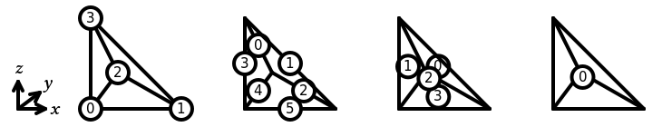
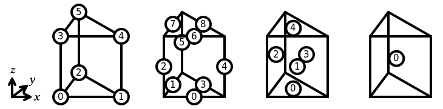

# Basix

[](https://github.com/FEniCS/basix/actions/workflows/pythonapp.yml)
[](https://github.com/FEniCS/basix/actions/workflows/spack.yml)
[](https://defelement.org/verification/basix.html)

Basix is a finite element definition and tabulation runtime library.
Basix allows users to:

- evaluate finite element basis functions and their derivatives at a set
  of points;
- access geometric and topological information about reference cells;
- apply push forward and pull back operations to map data between a
  reference cell and a physical cell;
- permute and transform DOFs to allow higher-order elements to be use on
  arbitrary meshes; and
- interpolate into and between finite element spaces.

Basix includes a range of built-in elements, and also allows the user to
define their own custom elements.

Basix is one of the components of FEniCSx, alongside
[UFL](https://github.com/fenics/ufl),
[FFCx](https://github.com/fenics/ffcx), and
[DOLFINx](https://github.com/fenics/dolfinx).


## Installation

To install Basix:
```console
pip install fenics-basix
```
We currently build binary wheels for Python 3.8 to 3.12 for Linux 
(x86-64, aarch64), macOS (x86-64, arm64) and Windows (x86-64).

For advanced and developer installation instructions see the more
detailed [install instructions](INSTALL.md)


## Documentation

Documentation of Basix can be found at
https://docs.fenicsproject.org/basix/main/.


## Support

If you find a bug in Basix, you can report it on the [GitHub issue
tracker](https://github.com/fenics/basix/issues/new?labels=bug).

Questions about using Basix can be asked on the [FEniCS discourse
group](https://fenicsproject.discourse.group/).


## Contributing

Information about how to contribute to Basix can be found
[here](CONTRIBUTING.md).

## Supported elements

### Interval

In Basix, the sub-entities of the reference interval are numbered as
follows:


The following elements are supported on an interval:

  - [Lagrange](https://defelement.org/elements/lagrange.html)
  - [Bubble](https://defelement.org/elements/bubble.html)
  - [Serendipity](https://defelement.org/elements/serendipity.html)
  - [Hermite](https://defelement.org/elements/hermite.html)
  - [iso](https://defelement.org/elements/p1-iso-p2.html)


### Triangle

In Basix, the sub-entities of the reference triangle are numbered as
follows:


The following elements are supported on a triangle:

  - [Lagrange](https://defelement.org/elements/lagrange.html)
  - [Nédélec first kind](https://defelement.org/elements/nedelec1.html)
  - [Raviart-Thomas](https://defelement.org/elements/raviart-thomas.html)
  - [Nédélec second kind](https://defelement.org/elements/nedelec2.html)
  - [Brezzi-Douglas-Marini](https://defelement.org/elements/brezzi-douglas-marini.html)
  - [Regge](https://defelement.org/elements/regge.html)
  - [Hellan-Herrmann-Johnson](https://defelement.org/elements/hellan-hermann-johnson.html)
  - [Crouzeix-Raviart](https://defelement.org/elements/crouzeix-raviart.html)
  - [Bubble](https://defelement.org/elements/bubble.html)
  - [Hermite](https://defelement.org/elements/hermite.html)
  - [iso](https://defelement.org/elements/p1-iso-p2.html)


### Quadrilateral

In Basix, the sub-entities of the reference quadrilateral are numbered
as follows:


The following elements are supported on a quadrilateral:

  - [Lagrange](https://defelement.org/elements/lagrange.html)
  - [Nédélec first kind](https://defelement.org/elements/nedelec1.html)
  - [Raviart-Thomas](https://defelement.org/elements/qdiv.html)
  - [Nédélec second kind](https://defelement.org/elements/scurl.html)
  - [Brezzi-Douglas-Marini](https://defelement.org/elements/sdiv.html)
  - [Crouzeix-Raviart](https://defelement.org/elements/rannacher-turek.html)
  - [Bubble](https://defelement.org/elements/bubble.html)
  - [DPC](https://defelement.org/elements/dpc.html)
  - [Serendipity](https://defelement.org/elements/serendipity.html)
  - [iso](https://defelement.org/elements/p1-iso-p2.html)


### Tetrahedron

In Basix, the sub-entities of the reference tetrahedron are numbered as
follows:



The following elements are supported on a tetrahedron:

  - [Lagrange](https://defelement.org/elements/lagrange.html)
  - [Nédélec first kind](https://defelement.org/elements/nedelec1.html)
  - [Raviart-Thomas](https://defelement.org/elements/raviart-thomas.html)
  - [Nédélec second kind](https://defelement.org/elements/nedelec2.html)
  - [Brezzi-Douglas-Marini](https://defelement.org/elements/brezzi-douglas-marini.html)
  - [Regge](https://defelement.org/elements/regge.html)
  - [Crouzeix-Raviart](https://defelement.org/elements/crouzeix-raviart.html)
  - [Bubble](https://defelement.org/elements/bubble.html)
  - [Hermite](https://defelement.org/elements/hermite.html)
  - [iso](https://defelement.org/elements/p1-iso-p2.html)


### Hexahedron

In Basix, the sub-entities of the reference hexahedron are numbered as
follows:


The following elements are supported on a hexahedron:

  - [Lagrange](https://defelement.org/elements/lagrange.html)
  - [Nédélec first kind](https://defelement.org/elements/nedelec1.html)
  - [Raviart-Thomas](https://defelement.org/elements/qdiv.html)
  - [Nédélec second kind](https://defelement.org/elements/scurl.html)
  - [Brezzi-Douglas-Marini](https://defelement.org/elements/sdiv.html)
  - [Bubble](https://defelement.org/elements/bubble.html)
  - [DPC](https://defelement.org/elements/dpc.html)
  - [Serendipity](https://defelement.org/elements/serendipity.html)
  - [iso](https://defelement.org/elements/p1-iso-p2.html)


### Prism

In Basix, the sub-entities of the reference prism are numbered as
follows:



The following elements are supported on a prism:

  - [Lagrange](https://defelement.org/elements/lagrange.html)


### Pyramid

In Basix, the sub-entities of the reference pyramid are numbered as
follows:


The following elements are supported on a pyramid:

  - [Lagrange](https://defelement.org/elements/lagrange.html)
