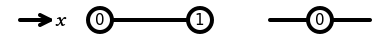
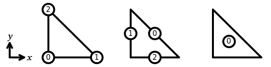
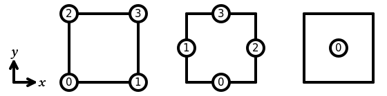
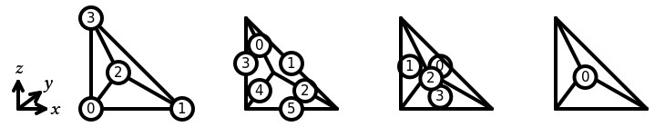
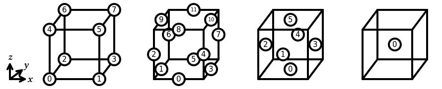
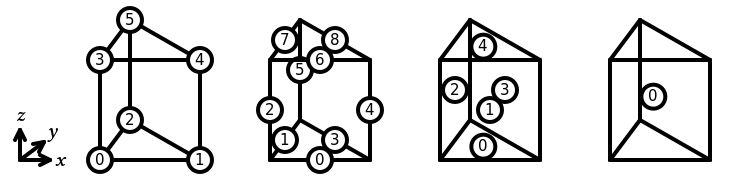
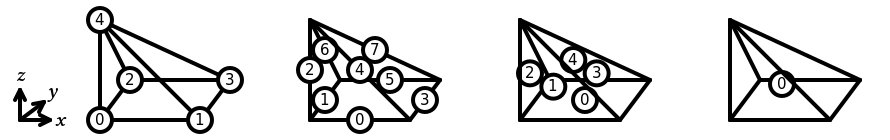

# Summary

The finite element method (FEM) [@ciarlet] is a widely used numerical
method for approximating the solution of partial differential equations
(PDEs). Solving a problem using FEM involves discretising the problem
and searching for a solution in a finite dimensional space: these finite
spaces are created by defining a finite element on each cell of a mesh.

Following @ciarlet, a finite element is commonly defined by a triple
$(R, \mathcal{V}, \mathcal{L})$, where:

- $R$ is the reference cell, for example a triangle with vertices at
  (0,0), (1,0) and (0,1);
- $\mathcal{V}$ is a finite dimensional polynomial space, for example
  $\operatorname{span}\{1, x, y, x^2, xy, y^2\}$;
- $\mathcal{L}$ is a basis of the dual space
  $\left\{f:\mathcal{V}\to\mathbb{R}\,\middle|\,f\text{ is linear}\right\}$,
  for example the set of functionals that evaluate a function at the
  vertices of the triangle and at the midpoints of its edges.

The basis functions of the finite element are the polynomials in
$\mathcal{V}$ such that one functional in $\mathcal{L}$ gives the value
1 for that function and all other functionals in $\mathcal{L}$ give 0. The
examples given above define a degree 2 Lagrange space on a triangle; the
basis functions of this space are shown in \autoref{fig:fe}.

![The six basis functions of a degree 2 Lagrange space on a triangle.
The upper three functions arise from point evaluations at the vertices.
The lower three arise from point evaluations at the midpoints of the
edges. These diagrams are taken from DefElement
[@defelement].\label{fig:fe}](img/basis-functions.png){ width=60% }

The functionals in $\mathcal{L}$ are each associated with a degree of
freedom (DOF) of the finite element space. Each functional (or DOF) is
additionally associated with a sub-entity of the reference cell.
Ensuring that the same coefficients are assigned to the DOFs of
neighbouring cells associated with a shared sub-entity gives the finite
element space the desired continuity properties.

Basix is a C++ library that creates and tabulates a range of finite
elements on triangles, tetrahedra, quadrilaterals, hexahedra, pyramids,
and prisms. The majority of Basix's functionality can be used via
its Python interface. A full list of currently supported elements is
included below.

For many elements, the functionals in $\mathcal{L}$ are defined to be integrals
on a sub-entity of the cell. Basix provides a range of quadrature rules to compute 
these integrals, including Gauss--Jacobi, Gauss--Lobatto--Legendre,
and Xiao--Gimbutas [@xiao-gimbutas]. Internally, Basix uses xtensor [@xtensor]
for matrix and tensor storage and manipulation.

Basix forms part of FEniCSx alongside DOLFINx [@dolfinx], FFCx [@ffcx],
and UFL [@ufl]. FEniCSx is the latest development version of FEniCS, a
popular open source finite element project [@fenics].

# Statement of need

Basix allows users to:

- evaluate finite element basis functions and their derivatives at a set
  of points;
- access geometric and topological information about reference cells;
- apply push forward and pull back operations to map data between a
  reference cell and a physical cell;
- permute and transform DOFs to allow higher degree elements to be used on
  arbitrary meshes; and
- interpolate into a finite element space and between finite element
  spaces.

A full list of the built-in elements currently supported in Basix is included below.
In addition to these element, users can create their own custom elements via either
C++ or Python.

Basix's support for permuting and transforming DOFs is one of its key features. In
an arbitrary mesh, neighbouring cells will not necessarily agree on the orientation
of shared sub-entities. For higher degree elements, this will lead to a mismatch
in the positioning and orientation of the DOFs associated with these sub-entities,
as shown in \autoref{fig:mismatched-orientations}.
Our use of permuting and transforming to rectify this issue is described in full
detail in @dof-transformations.

![Left: In a degree 4 Lagrange space on a triangle, there are three DOFs associated
  with each edge. If two neighbouring triangles disagree on the orientation of a
  shared edge, then the positions of the DOFs will not match up. Right: In a degree 1
  Nédélec first kind element on a tetrahedron, there are two DOFs associated with each
  triangular face. These DOFs will be associated with a vector tangential to the face
  of the triangles. If two neighbouring cells do not agree on the orientation of the
  triangle, then the directions of these vectors will not match.
  \label{fig:mismatched-orientations}](img/mismatched-orientations.png){ width=65% }

In order to compute the basis functions of a finite element, each functional
in $\mathcal{L}$ can be applied to the elements of a basis of the polynomial
set $\mathcal{V}$ to compute the *dual matrix*. This dual matrix can then be
inverted to obtain the coefficients that define the finite element basis
functions in terms of the basis of $\mathcal{V}$. In NGSolve [@ngsolve], the
functionals for this approach are implemented in C++ using lambda functions.
In MFEM [@mfem], the functionals are described in C++ using a set of points and
weights: for point evaluation functionals, there will be one point and the
weight will be 1; for integral functionals, quadrature points and weights are used.
In FIAT [@fiat] and Symfem [@symfem], the functionals are implemented as
Python objects. In Basix, we follow an approach similar to that taken by MFEM,
and define the functionals in C++ using a set of points and weights.

In many other libraries---including Dune [@dune] and Bempp [@bempp; @bempp-cl]---the
basis functions of the finite element space are implemented explicitly.

In a large number of finite element libraries---including NGSolve and MFEM---the
finite element definitions are included in the core of the library. In Dune,
the finite element definitions are separated into the `dune-localfunctions` module.
FIAT and Basix are the finite element definition and tabulations libraries used
by legacy FEniCS and FEniCSx (respectively). Symfem is a standalone element definition
library that computes basis functions symbolically. By separating the finite element
definitions from the core of the code, users are able to tabulate elements and
obtain information about them without having to interact with the other components of the library.
In FEniCSx for example, this allows users who want to create custom
integration kernels to get information about elements from Basix without
having to extract information from the core of the full finite element
library.

An additional advantage of this modular approach is that it allows
us to adjust how elements are implemented
and add new elements without needing to make changes to the other components
of FEniCSx.

For some high degree finite elements on tensor product cells (quadrilaterals and hexahedra),
elements can be more efficiently tabulated using sum factorisation: the elements
can be represented as the product of elements defined on an interval, and so can be
tabulated by combining copies of tabulated data on an interval rather than tabulating on the full cell.
This tensor product evaluation is implemented in MFEM, FInAT [@finat] and deal.ii [@dealii].
We have experimented with supporting these factorisations in Basix: in particular, details
of the factorisations for Lagrange elements are currently provided by the library.
We plan to support them more fully and for a wider range of elements in a future release.

The Python library FIAT [@fiat] (which is part of the legacy FEniCS
library alongside UFL, FFC [@ffc] and DOLFIN [@dolfin]) serves a
similar purpose to Basix and can perform many of the same operations
(with the exception of permutations and transformations) on triangles,
tetrahedra, quadrilaterals, and hexahedra. As FIAT is written in Python,
the FFC library would use the information from FIAT to generate code
that could be used by the C++ finite element library DOLFIN.

An advantage of using Basix is the ability to call functions from C++
at runtime. This has allowed us to greatly reduce the amount of code
generated in FFCx compared to FFC, as well as simplifying much of the
implementation, while still allowing FFCx to access the information it
needs using Basix's Python interface.

# Supported elements

## Interval

In Basix, the sub-entities of the reference interval are numbered as
shown in \autoref{fig:interval}. The following elements are supported on an interval:

- Lagrange
- bubble
- serendipity [@serendipity]

{ width=39% }

## Triangle

In Basix, the sub-entities of the reference triangle are numbered as
shown in \autoref{fig:triangle}.
The following elements are supported on a triangle:

- Lagrange
- Nédélec first kind [@nedelec1]
- Raviart--Thomas [@rt]
- Nédélec second kind [@nedelec2]
- Brezzi--Douglas--Marini [@bdm]
- Regge [@regge; @regge2]
- Hellan--Herrmann--Johnson [@hhj]
- Crouzeix--Raviart [@cr]
- bubble

{ width=56% }

## Quadrilateral

In Basix, the sub-entities of the reference quadrilateral are numbered
as shown in \autoref{fig:quad}.
The following elements are supported on a quadrilateral:

- Lagrange
- Nédélec first kind
- Raviart--Thomas
- Nédélec second kind [@sdivcurl]
- Brezzi--Douglas--Marini [@sdivcurl]
- bubble
- DPC
- serendipity

{ width=56% }

## Tetrahedron

In Basix, the sub-entities of the reference tetrahedron are numbered as
shown in \autoref{fig:tet}.
The following elements are supported on a tetrahedron:

- Lagrange
- Nédélec first kind
- Raviart--Thomas
- Nédélec second kind
- Brezzi--Douglas--Marini
- Regge
- Crouzeix--Raviart
- bubble

{ width=73% }

## Hexahedron

In Basix, the sub-entities of the reference hexahedron are numbered as
shown in \autoref{fig:hex}.
The following elements are supported on a hexahedron:

- Lagrange
- Nédélec first kind
- Raviart--Thomas
- Nédélec second kind
- Brezzi--Douglas--Marini
- bubble
- DPC
- serendipity

{ width=89% }

## Prism

In Basix, the sub-entities of the reference prism are numbered as
shown in \autoref{fig:prism}.
The following elements are supported on a prism:

- Lagrange

{ width=73% }

## Pyramid

In Basix, the sub-entities of the reference pyramid are numbered as
shown in \autoref{fig:pyramid}.
The following elements are supported on a pyramid:

- Lagrange

{ width=89% }

# References
